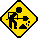

# w06-react-image-slider

> emoji toolbox  
> 🐈‍⬛🟢🟠🔴

## Requirements checklist

🟢 Implement the useState hook to manage gallery state (e.g. selected image).  
🟠 Use useEffect for initial fetching of images from an external API.  
🟢 Return JSX from multiple components (e.g., an ImageItem component for each image and a Gallery component to display them).  
🟢 Use the .map() function to render an array of images dynamically  
🟠 Implement functionality to display a larger version of an image when its thumbnail is clicked.  
🟠 Ensure all images have meaningful alt text.  
🟠 Ensure basic keyboard navigation for image selection (e.g., thumbnails should be focusable and activatable with Enter/Space).

### Stretch requirements

🔴 Use useEffect and the dependancy array to update the images when the user types in an input field.  
🔴 Set up an Unsplash application that you can fetch from your React app.  
🔴 Use .env to hide your API keys and tokens from the code.  
🔴 Style the application excellently, using grid or flex and positioning.

## Reflection

> tl;dr ya just gotta be sure

>  under conscruption

<!-- Text
Goes
Here   -->

### Thanks to/image credits

thanks, as always, to MDN.

https://www.dafont.com/vcr-osd-mono.font - ULTRAKILL font  
https://www.dafont.com/mmrock9.font - Megaman-style font  
https://www.spriters-resource.com/profile/mistermike/ - Megaman III sprites

## To improve

Time management  
Ambition management  
Focus management

marisa 🐈‍⬛
